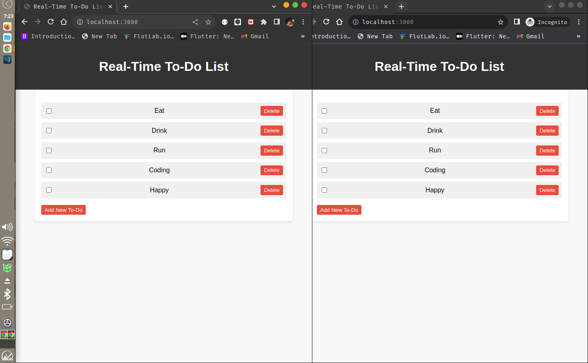

# Real-Time To-Do List App



A simple real-time to-do list application built using Node.js and Socket.io. This application allows users to collaboratively manage their to-do list in real-time.

## Features

- Real-time updates: Changes made to the to-do list are immediately reflected on all connected devices.
- Add new tasks: Users can add new tasks to the list.
- Mark tasks as complete: Users can mark tasks as completed or incomplete.
- Delete tasks: Users can remove tasks from the list.

## Installation

1. Clone this repository:

```
git clone https://github.com/your-username/real-time-todo-app.git
```

2. Navigate to the project directory:

```
cd real-time-todo-app
```

3. Install dependencies:

```
npm install
```

## Usage

1. Start the server:

```
node server.js
```

2. Open your web browser and visit `http://localhost:3000`.

3. Add, complete, and delete tasks in real-time.

## Technologies Used

- Node.js
- Express
- Socket.io

_Happy task managing!_
